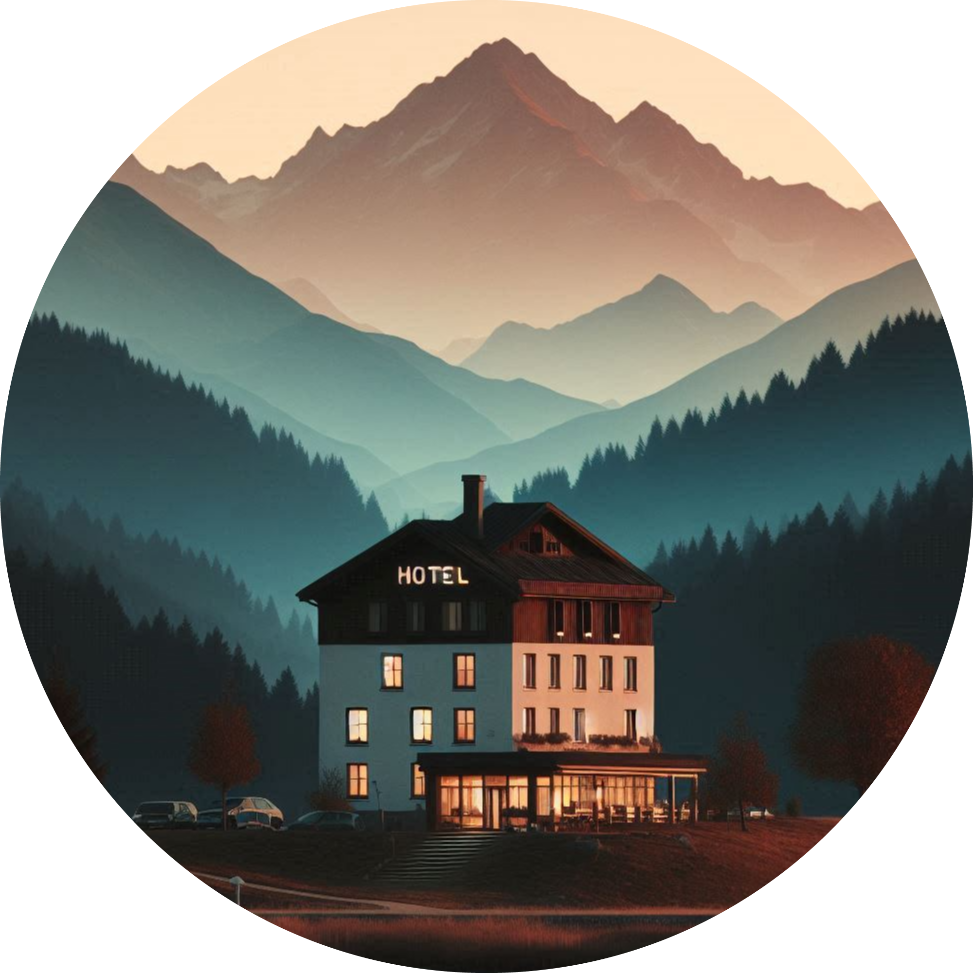
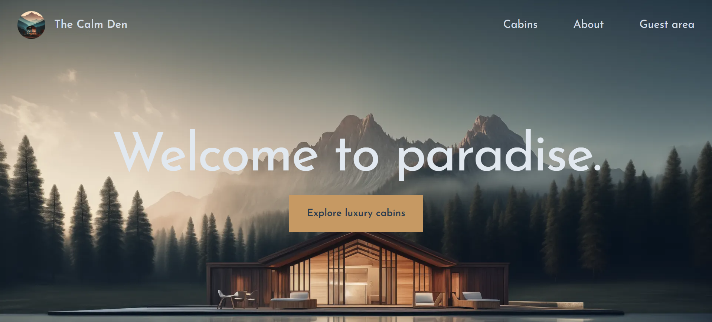

<h1  align="center">The Calm Den Website</h1>

The Calm Den Website is a  Next.js based customer facing platform for <a target="_self" href="https://the-calm-den.vercel.app/"><strong>The Calm Den</strong></a> hotel, showcasing luxury cabins and enabling guests to make reservations. It also features a guest area, allowing guests to view, edit, or delete their reservations and manage their profile details. Built with Supabase for the backend and Next.js for the frontend, it leverages cutting-edge React features like Suspense and Server Components.
 

</a>

 

 

## Table of contents

- [Key Features](#key-features)
- [My Journey with TheCalmDen](#my-journey-with-thecalmden)
  - [Built with](#built-with)
  - [What I learned](#what-i-learned)
  - [Continued development](#continued-development)
  - [Useful resources](#useful-resources)
- [Author](#author)
- [Acknowledgments](#acknowledgments)

## Key Features

- Users of the app are potential guests and actual guests
- Guests should be able to learn all about The Calm Den Hotel
- Guests should be able to get information about each cabin and see booked dates
- Guests should be able to filter cabins by their maximum guest capacity
- Guests should be able to reserve a cabin for a certain date range
- Reservations are not paid online. Payments will be made at the property upon arrival. Therefore, new reservations should be set to “unconfirmed” (booked but not yet checked in)
- Guests should be able to view all their past and future reservations
- Guests should be able to update or delete a reservation
- Guests need to sign up and log in before they can reserve a cabin and perform any operation
- On sign up, each guest should get a profile in the DB
- Guests should be able to set and update basic data about their profile to make check-in at the hotel faster

## My Journey with TheCalmDen

### Built with

- Next.js
- Supabase
- Next Auth
- HeroIcons
- Tailwind CSS
- React Day Picker
- Date-fns

### What I learned

- **Next.js Concepts** - I gained a solid understanding of Next.js, including metadata, layouts, navigation, streaming, and data mutations, enabling me to create a clean and performant user interface.
- **Authentication & Authorization** - I utilized next-auth library to integrate authentication using Google and added middlewares to authorize user with multiple checks.
- **Static and Dynamic Rendering** - I leveraged ISR (Incremental Static Regeneration) to render the static routes and implemented dynamic routes to render on demand.
- **Working with dates** - Integrated React Day Picker for seamless experience in cabin reservations, and utilised various methods from date-fns for date calculations.
- **Advanced React features** - I gained experience working with Server Components, Server Actions and Suspense. I also utilised advanced React hooks like useOptimistic and useTransition, optimising the rendering on the server and the overall experience.
- **Pre-rendering statically** - I explored methods to render the dynamic routes statically before they get requested
- **Project Planning and Management** - I acquired hands-on experience in planning the complex applications encompassing ideation, feature development, bug resolution and deployment processes.

### Continued development

I plan to delve deeper into advanced Next.js and React concepts and explore technologies like GraphQL, TypeScript, Zod and payments integratins, while focusing on building user-friendly applications.

### Useful resources

- [Next.js Documentation](https://nextjs.org/learn/dashboard-app) - This helped me understanding the various concepts in Next.js. I really liked the way concepts are explained and will use it as a reference going forward.
- [Whimsical](https://whimsical.com/) - This is an amazing tool for brainstorming ideas and building application flow on the whiteboard.
- [Open Next](https://opennext.js.org/) - Though I have not used this, but keeping it here for my reference to deploy Next.js projects on platforms other than Vercel.

## Author

- LinkedIn - [@onkareshwar-prasad](https://www.linkedin.com/in/onkareshwar-prasad/)
- Frontend Mentor - [@onkareshwarprasad17](https://www.frontendmentor.io/profile/onkareshwarprasad17)

Please feel free to reach out with any question or feedback!

## Acknowledgments

This application was developed as part of the [Udemy course](https://www.udemy.com/course/the-ultimate-react-course) by Jonas Schmedtmann. I extend my sincere gratitude to Jonas for his outstanding teaching and continuous guidance during the course.
